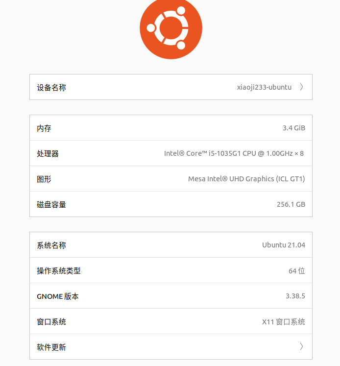
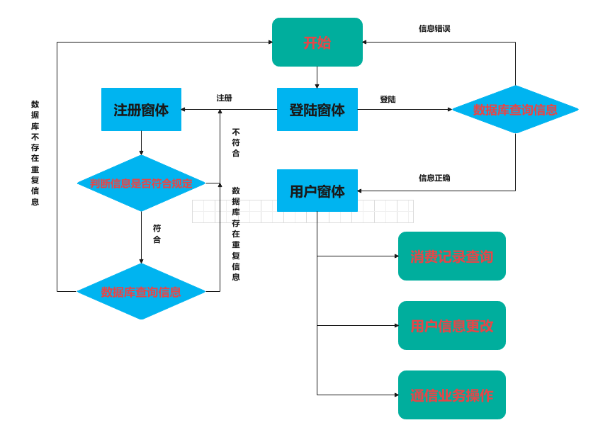
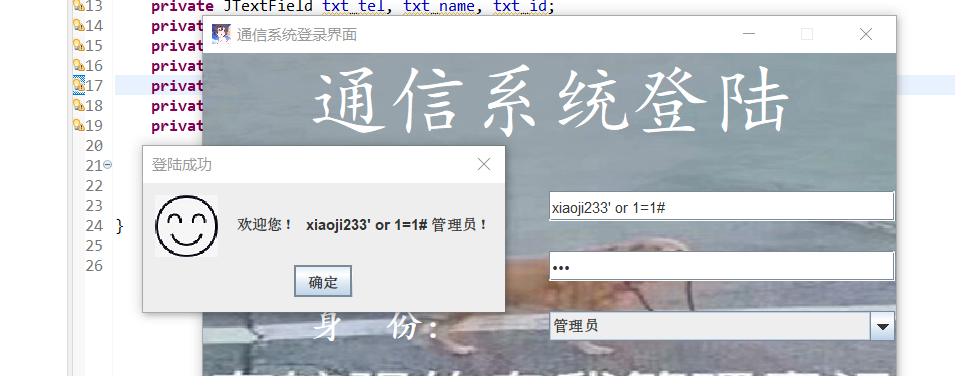

# 一、系统简介

​    我实现的是一个多用户计费通信系统。

​    此系统实现了以下功能：用户注册，用户登录，用户信息修改，价格管理，发送短信，

查看短信，发起通话，查看通话记录，话费充值和消费记录查询等功能。

​    在用户注册的功能实现中，单独使用一个窗体（RegisterWindow），继承JFrame并实现ActionListener接口。在ActionListener中用actionPerformed函数监听按钮动作并执行相应的功能。当用户点击了注册按钮之后先会检查输入信息是否合法，如果通过则会先对数据库发起查询请求确保注册的用户在数据库中并不存在，如果不存在则会将填写的信息转换成sql语句提供给数据库操作对象去执行增加记录的操作，成功之后则可以使用这个账号进行登录。

​    在用户登录功能中与注册同样，就不赘述了，不同的是登录是对数据库进行一次查询操作，主要语句为select * from user where user=’input1’ and password=’input2’，然后为了提升用户体验，会检测用户提交的请求是电话号码还是用户名。因此这里加了点限制：用户名必须以字母开头，以方便程序判断用户输入的是用户名还是手机号。

​    在用户信息修改功能中，使用了JTable类显示当前权限等级可以操作的用户。单击表单中的记录便可以将数据拉取到JText或者是JCombox中，然后用户可以在JText或者是选择JCombox中的选项进行修改。单击修改时同样会检测提交表单的数据，全部验证通过后会向数据库发起修改操作。当进行一次修改操作之后，会重新查询一遍当前可以看到的用户，以便数据实时更新。用户可以将账号删除，删除可以是本人自发删除，或者是比你高级权限的管理员发起删除请求，发起删除请求时会向操作用户发起询问，确认后则会进行数据库删除记录的操作，在查询的时候会用到ArrayList泛型数据结构保存查询到的记录。

​    价格管理功能中，其他用户可以实时查看各个业务的价格，当点击查看价格的时候会对数据库进行查询操作。root用户可以对价格进行修改，即对该数据库进行修改操作。

​    发送短信功能中，同样是对数据库进行增添记录的操作，在发送之前会询问发送对象是否正确，这个系统并不检测用户是否存在，毕竟如果你往一个已经被注销的手机号发送信息也是能发送成功的，比较贴近实际应用。

​    在发起通话的时候，为了检测用户通话时长，会在发起通话的时候记录当前计算机的时间戳，在结束的时候再次获取，两者相减得到了通话时长，以此计费，计费时会实时获取当前数据库中通话的价格再向用户数据库进行修改余额操作，会向通话记录和消费记录数据库进行增添记录的操作。

​    其余各个功能比较类似，不一一讲述了，本系统存在一个彩蛋，在修改手机号的时候会根据修改的手机号长度向用户收取一定的费用，费用为10^(11-电话号码的长度)，不是减少位数那就不会收费。

​    在实现的过程中各个功能与预想相差无几。

# 二、系统开发及运行环境

​    操作系统：

 在开发过程中使用的软件以及版本如下所示：

$java -version

openjdk version "17-ea" 2021-09-14

OpenJDK Runtime Environment (build 17-ea+19-Ubuntu-1ubuntu1)

OpenJDK 64-Bit Server VM (build 17-ea+19-Ubuntu-1ubuntu1, mixed mode, sharing)

$ javac -version

javac 17-ea

$ mysql --version

mysql Ver 8.0.26-0ubuntu0.21.04.3 for Linux on x86_64 ((Ubuntu))

数据库管理程序：Navicat15

JAVA IDE：Eclipse2021-09

# 三、系统设计

先根据题目要求设计出来的流程图如下图所示

 

在整个系统中预计将分四大类，分别是实体(entity)，窗体(view)，数据库操作对象(DAO)，数据库连接对象(dbutil)。

​    实体为绝⼤部分操作的对象，系统中将会存在⽤⼾，业务价格，消费记录，短信记录通话记录等实体。这些实体类将在读取数据库中被装到ArrayList当中，再以JTable展示出来，几乎每张数据表都对应了一类用户实体，数据表中的记录与实例化的实体对象一一对应。

窗体将作为⽤⼾的交互界⾯，为了确保用户体验，设计的窗体应当尽量美观，整齐，方便操作，并且应当尽可能用较少的窗体实现最多的功能。本系统有三个窗体，分别是登陆窗体 (LoginWindow)注册窗体 (RegisterWindow)和用户窗体 (UserWindow)。大部分的功能实现都将在用户窗体中实现，用户窗体与数据库连接对象密切联系，当要对数据库操作的时候会调用数据库操作对象进行操作并根据实际情况返回结果。

数据库操作对象主要负责各个数据表的操作，数据库操作对象会构造好sql语句并讲语句给数据库连接对象去连接数据库并执行对应的sql语句，并根据实际情况返回对象。

数据库连接对象主要接收由数据库操作对象构造的sql语句执行并返回对象。

# 四、系统实现 

正如上篇介绍，分为四大类：view包里面包含了窗体，为用于展示的用户界面。用户界面主要使用java swing进行编写。窗体类都继承JFrame并且实现ActionListener接口用于实现某些按钮的点击操作。某些按钮可能会提交数据库请求，这就需要用到数据库操作对象(DAO)了，数据库操作对象下一级还有实现数据库连接的对象(SQLHelper)。数据库连接对象仅提交由数据库操作对象构造的sql语句。很多带注入的语句会在view窗体类直接被过滤掉。数据库获得下来的记录会被记录为一个实体(entity)，这里用泛型数据类型ArrayList来保存获取的记录。

​    ①系统的安全性问题，因为程序的很多输入的地方都是会被提交到数据库当中去的，如果恶意构造字符串那么会导致数据库泄露，提权，甚至威胁到后台服务器。如下图所示为当时触发的一个sql注入漏洞的情形，在不知道密码的情况下能直接登录系统。并且可以进行堆叠注入，如果有人提交的用户名表单为xxx’ or 1=1;drop databases;#那么后果将十分严重。

 

​    ②功能太多，分窗体十分影响用户体验，程序设计初期甚至有将近10个窗体，切换繁琐，用户体验极差。

​    ③在点击JTable的时候发现数据表中的数据可以直接编辑，以此能达到修改余额的目的。

​    ④余额更新不及时，导致连续消费会少扣费。txt_money.setText(money);

​      txt_moneys.setText(money);

​      txt_moneyc

如何解决？

①为了安全到位，在任何用户可以提交表单请求的地方均有设置字符过滤以防止别用用心之徒对本系统进行注入攻击，具体解决措施为：用户名输入限定只能输入字母和数字的组合，手机号与id号只能输入数字，对身份证进行了简单的真伪校验。为了防止流量被抓取从而泄露密码，将对用户输入的密码进行md5的处理，登录进去不论权限均对密码没有知情权，这样做既保护了隐私，又避免了过于繁琐的防sql注入的判断。

②一开始对与所有的功能均采取了分窗体处理，即一个功能一个窗体，但是在实际使用体验看来十分不好，需要在窗体中实现各个窗体之间的相互的调用，使用起来窗口闪来闪去。因此采取了Jmenu类来切换功能窗口，每个功能的各个控件被一个Jpanel管理，切换的时候只需要清空mainJpanel然后在mainJpanel上放上对应功能的Jpanel即可，切换起来体验十分良好。

③在github上最终找到了方法，加了点代码让JTable不可以直接编辑，并且一次只能选择一行。

④原本打算采取余额文本框一个给三个JPanel用的，但是发现同一个控件不能同时被加载到不同的JPanel内，因此这个方案被抛弃，采用原来的设计，每次进行消费或者充值都将对三个保存余额的文本框及时进行余额更新操作。

 

# 五、总结

收获：通过本次的课程设计，我认识到了独立开发一个系统的艰难，也尝到了系统成功按照自己预想的结果运行的喜悦，这个暑假也学习到了图形化界面编程的知识和数据库变成的知识并且掌握地更牢了，提升了独立解决问题的能力。

系统问题：①未做到客户机与服务机之间的分离，如果投入使用安全性和可靠性可能会下降很多，由于时间的关系也没有成功实现这一点，也因为这点，网络编程在这个系统上显得无处安放。②没有做手机号欠费回收号码机制，在发送短信和通话的时候并没有检测对方手机号是否存在，只会在发送之前提醒用户确认手机号再发送或者拨打。③流量业务没有很好的实现，也许是因为自己实现的想法跟通话差不多便没有实现这个功能，不过价格表中还是能看到这个条目的信息。③证件号码仅做出了身份证的校验，主要是因为在演示过程中防止泄露真实的身份信息，并且主要代码思想借用了一位师傅的博客，稍后会在下面展示，最主要的还是正则表达式判断日期合法性的代码。④为了提升安全性本想在通信过程中使用RSA加密，但是出于种种原因，这个功能最终被废弃了。

# 写在最后

本项目已经参与完成学校Java课程设计答辩，其实作者就是懒得写文档，把原本要交的文档改一改用上来了，大家参考即可，不要直接clone源码交上去。本系统由本人与h3师傅共同完成，特此感谢一下那位师傅。

